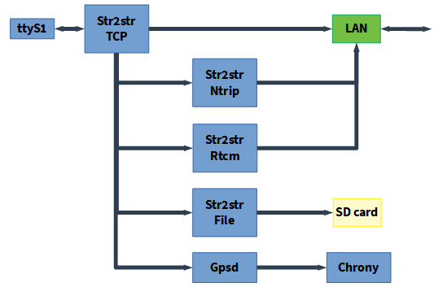

# RTKBase

### An easy to use and easy to install web frontend with some bash scripts and services for a simple gnss base station.

## FrontEnd:
||||

Frontend's features are:

+ View the satellites signal levels
+ View the base location on a map
+ Start/stop various services (Sending data to a Ntrip caster, Rtcm server, Log raw data to files)
+ Edit the services settings
+ Download/delete raw data

## Base example:


+ Enclosure: GentleBOX JE-200
+ SBC: Orange Pi Zero (512MB)
+ Gnss Receiver: U-Blox F9P (from Drotek)
+ Power: Trendnet TPE-113GI POE injector + Trendnet POE TPE-104GS Extractor/Splitter + DC Barrel to Micro Usb adapter

## Ready to flash release:
If you use a Raspberry Pi, thanks to [jancelin](https://github.com/jancelin), you can download a ready to flash iso file [here](https://github.com/jancelin/pi-gen/releases).

## Easy installation:

+ Connect your gnss receiver to your raspberry pi/orange pi/....

+ Open a terminal and:

   ```bash
   $ cd ~
   $ wget https://raw.githubusercontent.com/stefal/rtkbase/web_gui/tools/install.sh
   $ chmod +x install.sh
   $ sudo ./install.sh --all
   ```

+ Go grab a coffee, it's gonna take a while. The script will install the needed softwares, and if you use a Usb-connected U-Blox ZED-F9P receiver, it'll be detected and set to work as a base station. If you don't use a F9P, you will have to configure your receiver manually (see step 7 in manual installation), and choose the correct port from the settings page.

+ Open a web browser to `http://ip_of_your_sbc` (the script will try to show you this ip address). Default password is `admin`. The settings page allow you to enter your own settings for the base coordinates, ntrip credentials and so on...

   

   If you don't already know your base precise coordinates, it's time to read one of theses tutorial:
   - [rtklibexplorer - Post-processing RTK - for single and dual frequency receivers](https://rtklibexplorer.wordpress.com/2020/02/05/rtklib-tips-for-using-a-cors-station-as-base/)
   - [rtklibexplorer - PPP - for dual frequency receivers](https://rtklibexplorer.wordpress.com/2017/11/23/ppp-solutions-with-the-swiftnav-piksi-multi/)
   - [Centipede documentation (in french)](https://jancelin.github.io/docs-centipedeRTK/docs/base/positionnement.html)

## Manual installation: 
The `install.sh` script can be use without the `--all` option to split the installation process into several differents steps:
```bash
   $ ./install.sh --help
   ################################
   RTKBASE INSTALLATION HELP
   ################################
   Bash scripts for install a simple gnss base station with a web frontend.


   * Before install, connect your gnss receiver to raspberry pi/orange pi/.... with usb or uart.
   * Running install script with sudo

         sudo ./install.sh

   Options:
        --all
                         Install all dependencies, Rtklib, last release of Rtkbase, gpsd, chrony, services,
                         crontab jobs, detect your GNSS receiver and configure it.

        --dependencies
                         Install all dependencies like git build-essential python3-pip ...

        --rtklib
                         Clone RTKlib 2.4.3 from github and compile it.
                         https://github.com/tomojitakasu/RTKLIB/tree/rtklib_2.4.3

        --rtkbase-release
                         Get last release of RTKBASE:
                         https://github.com/Stefal/rtkbase/releases

        --rtkbase-repo
                         Clone RTKBASE from github:
                         https://github.com/Stefal/rtkbase/tree/web_gui

        --unit-files
                         Deploy services.

        --gpsd-chrony
                         Install gpsd and chrony to set clock from the gnss receiver.

        --crontab
                         add crontab tools, every day logs are archived

        --detect-usb-gnss
                         Detect your GNSS receiver.

        --configure-gnss
                         Configure your GNSS receiver.

        --start-services
                         Start services (rtkbase_web, str2str_tcp, gpsd, chrony)

   ```
So, if you really want it, let's go for a manual installation with some explanations:
1. Install dependencies with `sudo ./install.sh --dependencies`, or do it manually with:
   ```bash
   $ sudo apt update
   $ sudo apt install -y  git build-essential python3-pip python3-dev python3-setuptools python3-wheel libsystemd-dev bc dos2unix socat
   ```

1. Install RTKLIB with `sudo ./install.sh --rtklib`, or:
   + clone [RTKlib](https://github.com/tomojitakasu/RTKLIB/tree/rtklib_2.4.3)

      ```bash
      $ cd ~
      $ git clone -b rtklib_2.4.3 https://github.com/tomojitakasu/RTKLIB/rtklib_2.4.3
      ```

   + compile and install str2str:

      Optionnaly, you can edit the CTARGET line in makefile in RTKLIB/app/str2str/gcc
      
      ```bash
      $ cd RTKLIB/app/str2str/gcc
      $ nano makefile
      ```
      
      For an Orange Pi Zero SBC, i use:
      
      ``CTARGET = -mcpu=cortex-a7 -mfpu=neon-vfpv4 -funsafe-math-optimizations``
      
      Then you can compile and install str2str:
      
      ```bash  
      $ make
      $ sudo make install
      ```
   + Compile/install `rtkrcv` and `convbin` the same way as `str2str`.

1. Get latest rtkbase release `sudo ./install.sh --rtkbase-release`, or:
   ```bash
   $ wget https://github.com/stefal/rtkbase/releases/latest/download/rtkbase.tar.gz -O rtkbase.tar.gz
   $ tar -xvf rtkbase.tar.gz

   ```
   If you prefer, you can clone this repository to get the latest code.

1. Install the rtkbase requirements:
   ```bash
   $ python3 -m pip install --upgrade pip setuptools wheel  --extra-index-url https://www.piwheels.org/simple
   $ python3 -m pip install -r rtkbase/web_app/requirements.txt  --extra-index-url https://www.piwheels.org/simple
   $ python3 -m pip install rtkbase/tools/pystemd-0.8.1590398158-cp37-cp37m-linux_armv7l.whl

1. Install the systemd services with `sudo ./install.sh --unit-files`, or edit them (`rtkbase/unit/`) to replace the username, copy them to `/etc/systemd/system/` then enable the web server and str2str_tcp:
   ```bash
   $ sudo systemctl daemon-reload
   $ sudo systemctl enable rtkbase_web
   $ sudo systemctl enable str2str_tcp
   ```
1. Install and configure chrony and gpsd with `sudo ./install.sh --gpsd-chrony`, or:
   + Install chrony with `sudo apt install chrony` then add this parameter in the chrony conf file (/etc/chrony/chrony.conf):
   
      ```refclock SHM 0 refid GPS precision 1e-1 offset 0.2 delay 0.2```
   
     Edit the chrony unit file. You should set `After=gpsd.service`
   + Install a gpsd release >= 3.2 or it won't work with a F9P. Its conf file should contains:
   ```
      # Devices gpsd should collect to at boot time.
      # They need to be read/writeable, either by user gpsd or the group dialout.
      DEVICES="tcp://127.0.0.1:5015"

      # Other options you want to pass to gpsd
      GPSD_OPTIONS="-n -b"

   ```
   Edit the gpsd unit file. You should have someting like this in the "[Unit]" section: 
   ```
      [Unit]
      Description=GPS (Global Positioning System) Daemon
      Requires=gpsd.socket
      BindsTo=str2str_tcp.service
      After=str2str_tcp.service
   ```
   + Reload the services and enable them:
   ```bash
      $ sudo systemctl daemon-reload
      $ sudo systemctl enable chrony
      $ sudo systemctl enable gpsd
   ```

1. Connect your gnss receiver to raspberry pi/orange pi/.... with usb or uart, and check which com port it uses (ttyS1, ttyAMA0, something else...). If it's a U-Blox usb receiver, you can use `sudo ./install.sh --detect-usb-gnss`. Write down the result, you may need it later.

1. If you didn't have already configure your gnss receiver you must set it to output raw data:
   
   If it's a U-Blox ZED-F9P (usb), you can use 
   ```bash
   $ sudo ./install.sh -detect-usb-gnss --configure-gnss
   ```

   If it's a U-Blox ZED-F9P (uart), you can use this command (change the ttyS1 and 115200 value if needed)):
   ```bash
   $ rtkbase/tools/set_zed-f9p.sh /dev/ttyS1 115200 rtkbase/receiver_cfg/U-Blox_ZED-F9P_rtkbase.txt
   ```
     
   If you need to use a config tool from another computer (like U-center), you can use `socat`:

   ```bash
   $ sudo socat tcp-listen:128,reuseaddr /dev/ttyS1,b115200,raw,echo=0
   ```
   
   Change the ttyS1 and 115200 value if needed. Then you can use a network connection in U-center with the base station ip address and the port n°128.
  
1. If you log the raw data inside the base station, you may want to compress these data and delete the too old archives. `archive_and_clean.sh` will do it for you. The default settings compress the previous day data and delete all archives older than 90 days. To automate these 2 tasks, you can use `sudo ./install.sh --crontab` or:

   Edit your crontab with ``$ crontab -e`` and add these lines:
   ```bash
   SHELL=/bin/bash
   0 4 * * * /home/YOUR_USER_NAME/PATH_TO_RTKBASE/archive_and_clean.sh
   ```
   Cron will run this script everyday at 4H00.

1. Now you can start the services with `sudo ./install.sh --start-services`, or:
   ```bash
      $ sudo systemctl start rtkbase_web
      $ sudo systemctl start str2str_tcp
      $ sudo systemctl start gpsd
      $ sudo systemctl start chrony
   ```

   Everything should be ready, now you can open a web browser to your base station ip address.

## How it works:
RTKBase use several RTKLIB `str2str` instances started with `run_cast.sh` as systemd services. `run_cast.sh` gets its settings from `settings.conf`
+ `str2str_tcp.service` is the main instance. It is connected to the gnss receiver and broadcast the raw data on TCP for all the others services.
+ `str2str_ntrip.service` get the data from the main instance, convert the data to rtcm and stream them to a Ntrip caster.
+ `str2str_rtcm_svr.service` get the data from the main instance, convert the data to rtcm and stream them to clients
+ `str2str_file.service` get the data from the main instance, and log the data to files.



The web gui is available when the `rtkbase_web` service is running.


## License:
RTKBase is licensed under AGPL 3 (see LICENSE file).

RTKBase uses some parts of others software:
+ [RTKLIB](https://github.com/tomojitakasu/RTKLIB) (BSD-2-Clause)
+ [ReachView](https://github.com/emlid/ReachView) (GPL v3)
+ [Flask](https://palletsprojects.com/p/flask/) [Jinja](https://palletsprojects.com/p/jinja/) [Werkzeug](https://palletsprojects.com/p/werkzeug/) (BSD-3-Clause)
+ [Flask SocketIO](https://github.com/miguelgrinberg/Flask-SocketIO) (MIT)
+ [Bootstrap](https://getbootstrap.com/) [Bootstrap Flask](https://github.com/greyli/bootstrap-flask) [Bootstrap 4 Toggle](https://gitbrent.github.io/bootstrap4-toggle/) [Bootstrap Table](https://bootstrap-table.com/) (MIT)
+ [wtforms](https://github.com/wtforms/wtforms/) (BSD-3-Clause) [Flask WTF](https://github.com/lepture/flask-wtf) (BSD)
+ [pystemd](https://github.com/facebookincubator/pystemd) (L-GPL 2.1)
+ [gpsd](https://gitlab.com/gpsd/gpsd) (BSD-2-Clause)

RTKBase uses [OpenStreetMap](https://www.openstreetmap.org) tiles, courtesy of [Empreinte digitale](https://cloud.empreintedigitale.fr).
