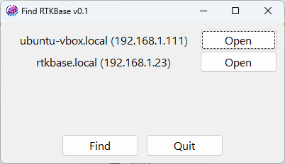

# find_rtkbase

This is a gui app to find RTKBase base station on the local network.
Executable files are available in the /dist directory for Windows x64 and Gnu/Linux x86_64.



## Download binary/executable release:
- Windows: [find_rtkbase.exe](https://github.com/Stefal/rtkbase/raw/refs/heads/master/tools/find_rtkbase/dist/find_rtkbase.exe)
- Gnu/Linux (need testing): [find_rtkbase](https://github.com/Stefal/rtkbase/raw/refs/heads/master/tools/find_rtkbase/dist/find_rtkbase)
## building binary/executable from source:

- without console option:

```pyinstaller find_rtkbase_noconsole.spec```

- with console option (find_rtkbase --help):

```pyinstaller find_rtkbase_console.spec```

